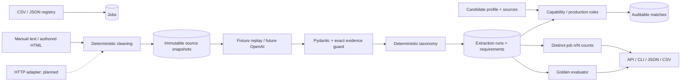

# Architecture

Files live under one `src/jobintel` package. Single-purpose modules provide registry,
acquisition, snapshots, providers, normalization, matching, analytics and evaluation.
`Service` coordinates transactions; API/CLI call the same services. Tests inject
provider data and disposable databases. No framework orchestration is needed.

Source snapshots are separated from extraction runs so a changed prompt or provider
does not overwrite the source. Matching references a concrete requirement row and
profile snapshot. The current job view only exposes results for its latest source.
Historical runs remain in the database but are not aggregated twice.

SQLite is a low-friction offline development mode. PostgreSQL and Alembic are the
target persistence path; PostgreSQL integration is required in CI. JSON payloads
keep the initial schema compact while foreign keys preserve provenance.

Live HTTP and OpenAI adapters are explicit stubs; optional Playwright/Anthropic do
not impose dependencies. Source code currently validates quote integrity, not the
semantic entailment of a claim; evaluation and planned grounded metadata address
that boundary. See specification sections 6–11 before enabling live integrations.
